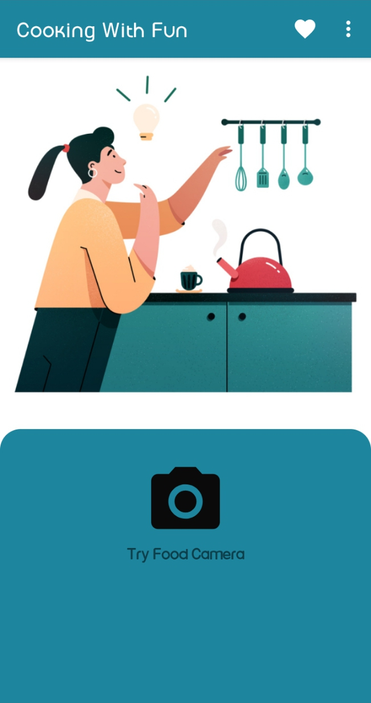
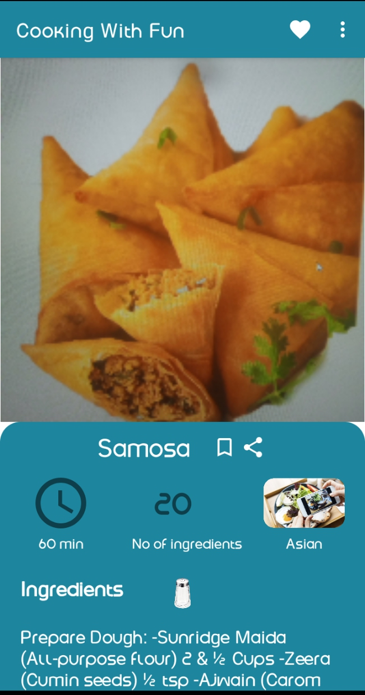
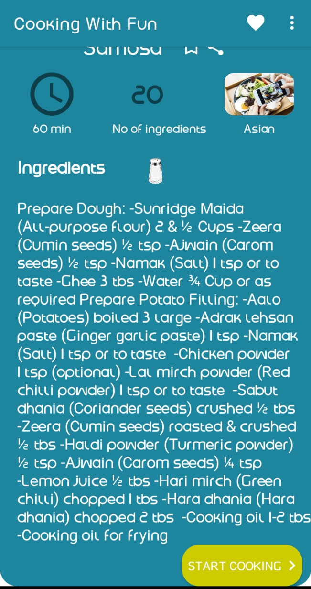
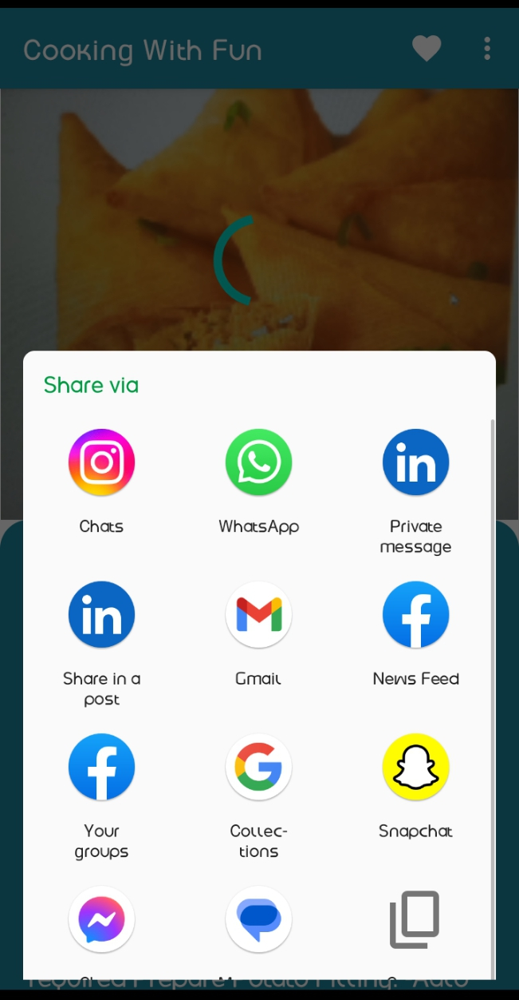

# Foodify 🍜

**Point your camera at a plate of food — get the recipe back.**

Foodify is a native Android app that identifies a dish from a single photo using on-device TensorFlow Lite, then returns the recipe name, ingredient list, cooking instructions, estimated prep time, cuisine type, and a video tutorial.

## Why

We increasingly eat food we didn't cook — takeaways, restaurants, catering — so detailed information about what's actually on the plate is hard to come by. Foodify closes that gap: photograph the meal, and the app infers the ingredients and cooking process for you.

## Interface

<p float="left">
  
  
  
  
</p>

## Features

- **Food recognition camera** — snap a photo and the app classifies the dish on-device, then shows the recipe name, full ingredient list with count, step-by-step instructions, prep time, cuisine type (Continental, Asian, and more), and an embedded video tutorial for the recipe.
- **Accounts** — register and sign in with email or social login (Firebase Auth).
- **Save recipes** — bookmark favourites to your account and access them from any device (Firestore-backed).
- **Share** — send recipes to friends on social media.

## How the recognition works

Classification runs entirely on-device with **TensorFlow Lite** — no image ever leaves the phone.

The classifier is a MobileNetV2-based transfer-learning model (~2 MB, 224×224 float32 input) with a custom dense head, trained on a small self-collected dataset of six South Asian dishes — Aloo Gajar Matar Sabzi, Chicken Shawarma, Gajar Halwa, Gulab Jamun, Samosa, and Noodles. Inference runs on-device via TensorFlow Lite with Android Studio's ML Model Binding, CPU execution — typically well under 200 ms per frame on a mid-range phone.
The deliberately small class set kept the focus on the end-to-end product: camera pipeline → on-device classification → recipe lookup in Firebase. Extending coverage is a data problem, not an architecture change — swap in a model trained on more classes (e.g. Food-101) and the app works unchanged.

Recognised dishes are matched against a recipe database in Firebase, which supplies the ingredients, instructions, and video link.

## Build & run

1. Clone the repo and open it in Android Studio.
2. Add your own `google-services.json` (Firebase console → project settings) to `app/`.
3. Sync Gradle and run on a device or emulator (minSdk [FILL IN]).

## Tech stack

Java · Android SDK · TensorFlow Lite (+ metadata/support libs) · Firebase (Auth, Firestore, Storage, Realtime Database, Analytics) · AndroidX · Android YouTube Player

<details>
<summary>Key dependencies</summary>

```gradle
implementation 'org.tensorflow:tensorflow-lite-support:0.1.0'
implementation 'org.tensorflow:tensorflow-lite-metadata:0.1.0'
implementation platform('com.google.firebase:firebase-bom:29.0.0')
implementation 'com.google.firebase:firebase-auth'
implementation 'com.google.firebase:firebase-firestore:24.0.0'
implementation 'com.google.firebase:firebase-storage:20.0.0'
implementation 'com.google.firebase:firebase-database:20.0.2'
implementation 'com.pierfrancescosoffritti.androidyoutubeplayer:core:10.0.5'
```
</details>

## Author

**Rizwan Hussain** — [GitHub](https://github.com/rizwanhussain98) · [LinkedIn](https://www.linkedin.com/in/rizwanhussain98/)
